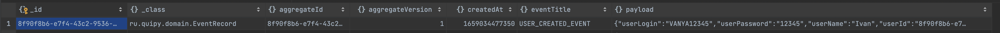

# Tiny event sourcing library

## Installation
Sadly, but right now we don't have any publicly available repositories to download from, so in order to use the library you'll have to download and install it manually.

To add library to your project put the following dependency in your `pom.xml`:
```
<dependency>
    <groupId>ru.quipy</groupId>
    <artifactId>tiny-event-sourcing-lib</artifactId>
    <version>${library.version}/version>
</dependency>
```

# Example of how to use library
## Theory
https://www.eventstore.com/event-sourcing - a good source of information about event sourcing.
https://microservices.io/patterns/data/cqrs.html -  CQRS. 
In short, CQRS stands for Command and Query Responsibility Segregation, a pattern that separates read and update operations for a data store.

## Example
# Config 
In order to use our library we have to set up config. This can be done 2 ways:
First one is used with Spring:
We have to subscribe our aggregate to subscription manager, and create beans of the services we're using:
```kotlin
  subscriptionsManager.subscribe<UserAggregate>(userEventsSubscriber)
```
```kotlin
  @Bean
fun userEventSourcingService() = eventSourcingServiceFactory.getOrCreateService(UserAggregate::class)
```
Then we have to write EventStoreDbOperations or we can just take the one that is written in this example. Then we have to add SpringAppConfig the way it works here.
# Our example uses both CQRS and Event Sourcing.
First, when we implement events sourcing pattern we have to define aggregates. In this example we will be having user aggregate.
```kotlin
@AggregateType(aggregateEventsTableName = "aggregate-user")
data class UserAggregate(
    override val aggregateId: String
) : Aggregate {
    override var createdAt: Long = System.currentTimeMillis()
    override var updatedAt: Long = System.currentTimeMillis()

    var userName: String = ""
    var userLogin: String = ""
    var userPassword: String = ""
    lateinit var defaultPaymentId: UUID
    lateinit var defaultAddressId: UUID
    var paymentMethods = mutableMapOf<UUID, PaymentMethod>()
    var deliveryAddresses = mutableMapOf<UUID, DeliveryAddress>()
}
```
@AggregateType annotation stores MetaInformation about aggregate recognisable by library.
User written Aggregate class has to extend Aggregate class from the library.
Each aggregate has its own domain events. They're written in UserAggregateDomainEvents.kt.
This is the example of one of the events:
```kotlin
@DomainEvent(name = USER_CREATED_EVENT)
class UserCreatedEvent(
    val userLogin: String,
    val userPassword: String,
    val userName: String,
    val userId: String,
    createdAt: Long = System.currentTimeMillis(),
) : Event<UserAggregate>(
    name = USER_CREATED_EVENT,
    createdAt = createdAt,
    aggregateId = userId,
) {
    override fun applyTo(aggregate: UserAggregate) {
        aggregate.userLogin = userLogin
        aggregate.userPassword = userPassword
        aggregate.userName = userName
    }
}
```
I want to highlight why we need to use
```kotlin
override fun applyTo(aggregate){
    
}
```
The applyTo method contains logic of applying the changes that the event describes (because the event describes the fact of the change). 
It transits the aggregate state from state A (before the change) to the state B (after the change).
If we take all the events (N events) from aggregate event log and iteratively call applyTo method starting with an empty aggregate state, it will go over N state transitions and will end up in the most actual state.
It must be implemented by the user.

@DomainEvent annotation is also from the library. It accepts name of the event.
Each event accepts some parameters from the constructor, returns event that belongs to the aggregate:
```kotlin
Event<UserAggregate>
```

This is how this event looks in database:

Second important concept of this example are subscribers. We can do subscriptions 2 ways.
First one is this:
```kotlin
@Service
@AggregateSubscriber(aggregateClass = UserAggregate::class, subscriberName = "demo-user-stream")
class AnnotationBasedUserEventsSubscriber {
    private val logger: Logger = LoggerFactory.getLogger(AnnotationBasedUserEventsSubscriber::class.java)

    @SubscribeEvent
    fun userCreatedSubscriber(event: UserCreatedEvent) {
        logger.info("User created {}", event.userName)
    }
}
```
As can be seen from the name of the class, it's annotation based. 
It uses @AggregateSubscriber annotation, and listens to specific aggregate type catching it events.
In the example we catch UserCreatedEvent and write it down in the logger.
The second way of doing subscriptions will be shown in the next chapter that is about Projections.

Another important aspect of example is projections/views usage. 
Aggregates are mostly used for writing and changing information. 
In order to present information we use concept of projections/views. 
Briefly speaking, projections/views are slices of some aggregates tailored for some usage. 
In the example we're using projections for payments.
Hence, we take from aggregate only the information we need for payments
```kotlin
class UserPaymentsViewDomain {
    @Document("user-payment-view")
    data class UserPayments(
        @Id
        override val id: String, // userId
        var defaultPaymentMethodId: UUID? = null, //Id of favorite payment
        val paymentMethods: MutableMap<UUID, Payment> = mutableMapOf() // map to hold all payments
    ) : Unique<String>

    data class Payment(
        val paymentId: UUID,
        val payment: String
    )
}
```
This is the projection created for payment service. 
It has only the fields that are needed by payments system.
```kotlin
class UserPaymentsViewService(
    private val userPaymentsRepository: UserPaymentsRepository,
    private val subscriptionsManager: AggregateSubscriptionsManager
) {
    private val logger: Logger = LoggerFactory.getLogger(UserPaymentsViewService::class.java)

    @PostConstruct
    fun init() {
        subscriptionsManager.createSubscriber(UserAggregate::class, "userPayments-payment-event-publisher-stream") {
            `when`(UserCreatedEvent::class) { event ->
                createUserPayment(event.userId, event.userName)
                logger.info("User Payment Created {}", event.userName)
            }
            `when`(UserAddedPaymentEvent::class) { event ->
                addPayment(event.paymentMethodId, event.userId, event.paymentMethod)
                logger.info("User Payment added {}", event.paymentMethod)
            }
            `when`(UserSetDefaultPaymentEvent::class) { event ->
                setDefaultPayment(event.userId, event.paymentMethodId)
                logger.info("Default User Payment selected {}", event.paymentMethodId)
            }
        }
    }
    private fun createUserPayment(userId: String, userName: String) {
        val userPayments = UserPaymentsViewDomain.UserPayments(userId)
        userPaymentsRepository.save(userPayments)
    }
}
```
This is service that works with this projection. Whenever a UserCreatedEvent is emitted by  UserAggregate it catches it,
and creates a userpayment entity of this user. Also here you can see a second way to create subscriptions using subscription manager and `when`

