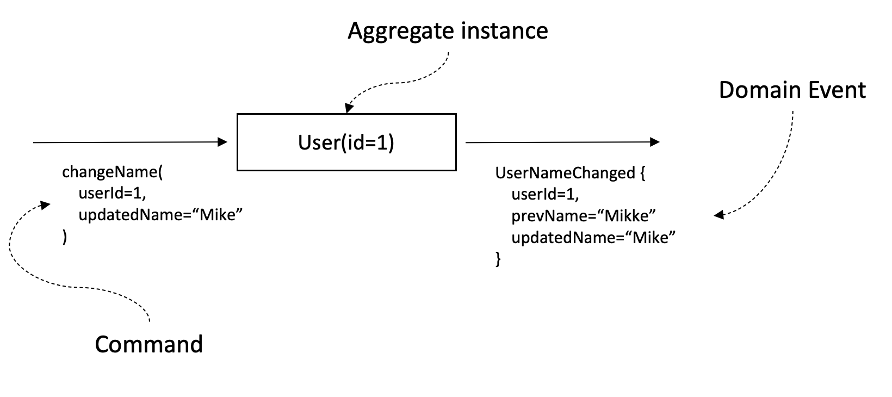
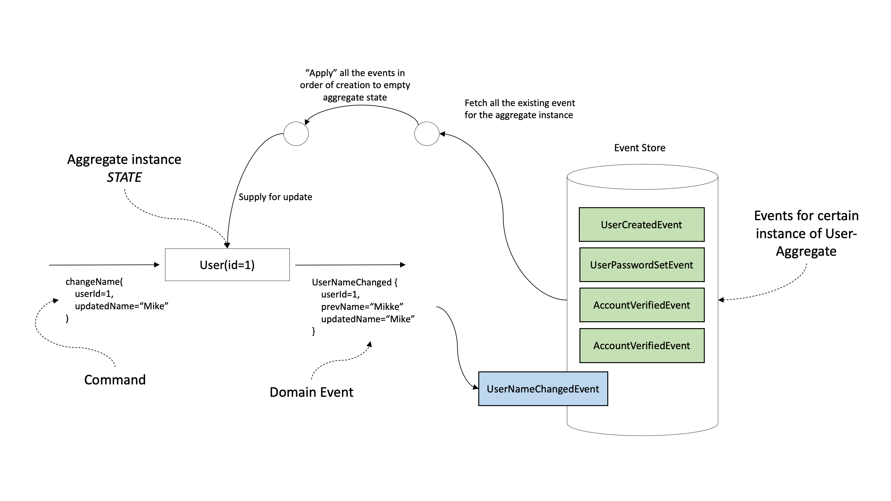
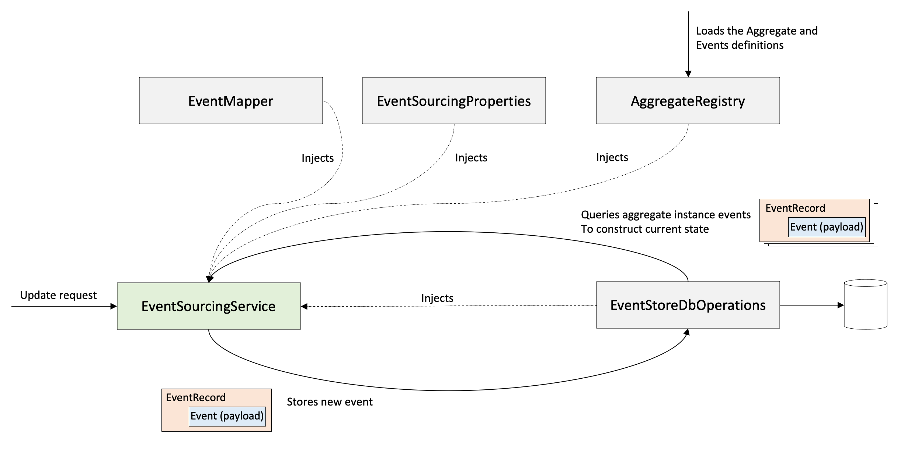

# Tiny event sourcing library

## Installation
Sadly, but right now we don't have any publicly available repositories to download from, so in order to use the library you'll have to clone the repository to your machine and perform from the repository's root directory:
```
mvn clean install
```

To add library to your project put the following dependency in your `pom.xml`:
```
<dependency>
    <groupId>ru.quipy</groupId>
    <artifactId>tiny-event-sourcing-lib</artifactId>
    <version>${library.version}/version>
</dependency>
```

# DDD, Event sourcing and library essentials

All the terms and technics described in this documentation are part of the Domain Driven design (DDD). You **don’t have to have** some specific knowledge or skills in DDD to use this library. But if you would like to get familiar with it we can recommend [Implementing Domain-Driven Design](https://www.amazon.com/Implementing-Domain-Driven-Design-Vaughn-Vernon/dp/0321834577) book by Vaughn Vernon.

## The short definition of **Event Sourcing** and **Domain events**

Event sourcing implies the storing an entity as a set of its changes. In order to get the entity you have to obtain all the changes and “apply” them all in order they were made. This approach can give you many benefits:

- You can have full log of changes with an authorID/timestamps
- You can get the state of any entity at any point of time
- Other services can listen to the changes and maintain its own local projection of the data they need
- Any of such listeners may be embedded in your system at any point of time and just “read” all the changes from scratch to initialize their local storages. Or they can just replay all the changes in order to migrate their schema for example

These “changes” may have arbitrary structure - you can put there anything you wish to have a comprehensive description of what / where / why / when / by whom was changed.

Since a change describes the *fact* of changing and its details, describes what happened with the entity (Past tense) it’s called **Event** and since it’s something important that happened with some entity within your *domain* it’s called **Domain Event**

**Domain Event** is a central concept of Event sourcing approach. Because each entity is persisted as a set of **Domain Events** and each update/write operation to your system results in a **Domain Event.**

In order to designate that the class is an event of your domain you should mark it with `@DomainEvent` annotation and extend `Event` base class. See the [example](#define-domain-events).

## **Entities** and **Aggregates**

We’ve discussed that in the event-sourcing based systems any change is represented by domain event. Other important concepts - **Aggregates** and **Entities.** These are something that describes our data model and that might be changed. They are the *objects* of changes.

**Entity** in DDD represents some meaningful concept of you business/domain. Each single instance of the entity has an identity. For example within “online-shopping” domain the items in a shopping cart might be an entities with their own id, properties and even links to some other entities like catalog items. In our library we don’t have some special syntax for entities - they are just regular classes.

**Aggregate** represents the *cluster* or *tree* of **Entities** united under some **root entity.** As well as an entity, aggregate has its own ID and can point to some other aggregate by their ID. Developing the previous example in “online-shopping” domain we could represent a shopping cart as an aggregate which contains the list of entities - “cart items”.

Why do we need this? We group logically connected entities into aggregates according to business rules and needs. Aggregate will act as a single unit of update operation in our system. No single entity can be changed apart from the aggregate it’s held by. If you want to change “cart item” you have to submit request to change “shopping cart” and the certain item inside it.

This property enables an aggregate to be a “transactional boundary” - something that is always be changed atomically. That also means that you can define the global invariants that should be maintained within aggregate and all of its nested entities and be sure that they are still enforced after each single update operation.

Let me give a bit farfetched example. You may have a counter in your “shopping cart” which shows how total cost of the “items” in the cart. Each time you add the item you have to increase this total cost. If we had relational DB schema we would have to perform two SQL queries - update items table and then update shopping carts table to increase the total cost. In concurrent environment you have to perform these two queries in a DB transaction to ensure atomicity, consistency, isolation (read [ACID](https://youtu.be/cY9NaL8KT14)). The aggregates bring some kind of denormalisation, but only to the extent that is required and useful for your business, functional and non-functional requirements. As the operation under an aggregate always atomic you can just add item and increase the counter in one method and be sure that after update all the invariants will be enforced.

Aggregate might be a tree of entities, but doesn’t have to be. It might be represented by just a single top level entity. It’s absolutely fine and depends on your application use cases and non-functional requirements. It’s a separate art of designing your aggregates and what “size” they should be. You can find articles about how to choose right size of the aggregates, there are some approaches.

Aggregate cannot be nested in some other aggregate because by definition it would become a single aggregate in this case. But you can easily connect aggregates with each other by referencing them by ID.

In order to designate that the class is an aggregate of your domain you should mark it with `@AggregateType` annotation and extend `Aggregate` base class. See the [example](#define-aggregates).

## **Commands**

We already know that the **Domain Event** is a result of update and the **Aggregate** is an object of an update.

Commands serve as a trigger for update. We (as a system or system’s user) can command to the aggregate to do something. It will then result into domain event publishing if changes succeeded.

In event sourcing the command itself doesn’t make any changes (I mean in DB, because it’s events responsibility), but logic behind command should check the **possibility** of the change, check aggregates **invariants** after the change is applied etc. If change is legal then we can construct the corresponding event and try to save it to DB. Once the event is persisted we can say that command succeeded

In our library the command of `Aggregate` N can be any function that takes instance of N as a receiver (takes an **aggregate state**) and returns subclass of the `Event<N>`. `N.(?) → Event<N>`. Command can take arbitrary number of parameters needed for update. Command logic might and should throw exceptions in case update fails by any reason. So you can check all business rules, perform validations, check aggregate inner invariants here. See the [example](#define-commands).



## **Aggregate state**

Aggregate state represents the state of an aggregate instance after applying some number of changes (events).

Aggregate instance may have a version. It shows the number of events that was applied to the state starting with empty state.

Every new event (change / update) will introduce some changing in an aggregate state. So far as we persist events, not the bare aggregate we will be able to get the state of the aggregate at any point of time by getting all the events up to some version and iteratively "applying" all these events to the aggregate state starting from empty state.

What do we mean by “applying” changes? Interface `AggregateStateTransitionFunction` represents a simple function that takes aggregate state, some aggregate's event and applies the changes described by the event to the state producing the next (updated) state.
You have to implement the logic of applying for each event of an aggregate. Such a function might be implemented both as the member of the aggregate state and as an extension function of the aggregate state and should be marked with `StateTransitionFunc` annotation.

The library code during update:

- Retrieves all the aggregate’s instance events from DB
- Build the current aggregate state by:
  - Creating the empty aggregate state (your state class **must have an empty constructor** for this purpose)
  - Iteratively applying all the event in the insertion order to it. (snapshots optimization is also available)
- Tries to apply new event to the current state to check if it is applicable indeed
- If some parallel process managed to update aggregate earlier than process ran by you (read: they were running simultaneously, but not yours won) you have to repeat your attempt. Just because the state of the aggregate changed and now some of the validations may fail or some invariants may be broken. Library takes care of such cases. You may not to think about the concurrency troubles - your responsibility is just define aggregates, events and business logic - commands with validations and other checks and events with how they should be applied to an aggregate state.

See the example of how to define [aggregate state](#define-aggregate-state) and state [transition functions](#define-aggregate-state-transition-functions)



## Library configuration

First thing you have to do is to define your aggregates, their states, events, commands and state transition functions. See example [here](#example-of-how-to-use-library)

### Manual library configuration

If you use pure library without any frameworks, you have to instantiate or implement the following classes/interfaces:
- Interface `EventMapper` that allows to map some row representation (json String by default) of event to instance of `Event` class and vice versa. There is default implementation for event represented in json format `JsonEventMapper` .
- Class `EventSourcingProperties` contains properties for event sourcing library. You can instantiate the class the default values or read some configuration file and initialize config with this values
- Interface `AggregateRegistry` acts as a local storage of the aggregates and their events meta-information. Provides methods to store (register) this meta-information. Library provides two implementation of the interface: `SeekingForSuitableClassesAggregateRegistry` and `BasicAggregateRegistry` . First automatically scans the classpath (you can define the package for scan in properties) and find all the classes that are marked with `AggregateType` and extend `Aggregate` as well as those marked with `DomainEvent` and extend `Event`  and register them. `BasicAggregateRegistry` requires all the aggregates and event to be manually registered. (**todo example**)
- Interface `EventStoreDbOperations` abstracts away the DB access. Provides the operations for event sourcing functioning. You can provide your own implementation of EventStoreDbOperations and run event sourcing app working on any DB you wish under the hood. There is implementation of `EventStoreDbOperations` which uses MongoDB and can be used only for Spring apps.
- Class `EventSourcingService` for each of the aggregates in your domain. Allows you to update aggregates and get the last state of the aggregate instances. It's convenient to use `EventSourcingServiceFactory` for instantiation of the `EventSourcingService` instances. See [here](#performing-updates-operation-under-the-aggregates).

Here is the class diagram


### Spring application configuration

There is [Spring Boot starter](tiny-event-sourcing-spring-boot-starter) module provided with the library, which can create for you most infrastructure classes and add them to the context. So if you want to create a Spring application, you can simply add dependency on this module like it performed in [this sample application](tiny-event-sourcing-spring-app).

# Example of how to use library

First, when we implement events sourcing based system we have to define aggregates and their states. In this example we will be having project aggregate.
It represents a project of our task-management system. For the sake of example project aggregate encapsulates all the task in the project and the tags that might be assigned to tasks.
Each task and tag is a separate entity with their own ID. You can see that the structure is denormolized.

This example is farfetched a bit. Tags and task methods might have been (and probably should be) separate aggregates. But it's supposed to demonstrate you the benefits of atomic updates.
For example, you can atomically add new tag to project and increment some counter that shows how many tags we have in project.

## Define Aggregates

In our library the aggregate itself is a part of the public API. Therefore, it doesn't contain any business logic. Just serves as a marker for other services that there is such an aggregate with some number of events. Services may import this public API and subscribe to the aggregate's events.
Lets define Project Aggregate:
```kotlin
@AggregateType(aggregateEventsTableName = "aggregate-project")
class ProjectAggregate : Aggregate
```
`@AggregateType` annotation contains some meta-information about aggregate recognisable by library. For example here we define the name of the database table which stores events for aggregate of type `ProjectAggregate`.
User written Aggregate class has to implement Aggregate interface-marker from the library.

## Define Aggregate state

Now we need some class that describes the inner state of the aggregate instance at different points of time. It's used only for your service and can be defined this way:
```kotlin
class ProjectAggregateState: AggregateState<String, ProjectAggregate> {
  private lateinit var projectId: String
  private var createdAt: Long = System.currentTimeMillis()
  private var updatedAt: Long = System.currentTimeMillis()

  private var tasks = mutableMapOf<UUID, TaskEntity>()
  private var projectTags = mutableMapOf<UUID, ProjectTag>()

  override fun getId() = projectId
}

// nested aggregate entity
data class TaskEntity(
    val id: UUID = UUID.randomUUID(),
    val name: String,
    val tagsAssigned: MutableSet<UUID>
)

// nested aggregate entity
data class ProjectTag(
    val id: UUID = UUID.randomUUID(),
    val name: String
)
```
As you can see here we define the aggregate state with all of its internals - nested entities and any other fields you wish. It just should reflect the state of the aggregate.
Note that we have to implement method `fun getId()` defined by `ProjectAggregateState` and pay attention to its contract. It returns the aggregate ID or null if the state is just created (empty, initial state). The ID should be assigned by the first aggregate command-event pair.

## Define Domain events

Each aggregate has a set of domain events. Events along with Aggregates are the public API of a service. Other services may import them to subscribe and listen to your services changes. Event classes does not contain any business logic. Just set of properties that describes what was changed.

Example below demonstrates how we define event of creating new **tag** within the project:
```kotlin
@DomainEvent(name = TAG_CREATED_EVENT)
class TagCreatedEvent(
    val projectId: String,
    val tagId: UUID,
    val tagName: String,
    createdAt: Long = System.currentTimeMillis(),
) : Event<ProjectAggregate>(
    name = TAG_CREATED_EVENT,
    createdAt = createdAt,
)
```

`@DomainEvent` annotation is also from the library. It accepts name of the event. Name will be persisted to DB and used to know which class the row content of the event should be deserialized to.
This is how this event with its meta-information looks in database:


## Define commands
Commands in our library are represented by methods that take current aggregate state, perform all checks and validations and produces event if changes is allowed and legit. For example, it may be a member function of the aggregate or extension function.
```kotlin
fun UserAggregate.createUserCommand(
   userId: UUID = UUID.randomUUID(),
   name: String,
   password: String,
   login: String
): UserCreatedEvent {
   if (name.length < 3) {
      throw IllegalArgumentException("Name is too small aggregate id: $aggregateId")
   }
   if (password.isBlank()) {
      throw IllegalArgumentException("Can't change password: empty provided. Aggregate id: $aggregateId")
   }
   if (password.length < 8) {
      throw IllegalArgumentException("Password is too weak aggregate id: $aggregateId")
   }
   
   return UserCreatedEvent(
      userId = userId,
      userLogin = login,
      userPassword = password,
      userName = name
   )
}
```

## Define aggregate State transition functions

There is one thing left to do before we are able to make changes on our aggregates. We have to teach the library to construct a current state of an aggregate.
Each event describes changes that move aggregate state N to the next state N + 1. It's done by `AggregateStateTransitionFunction`. A state transition function takes aggregate state, some aggregate's event and applies the changes described by the event to the state producing the next (updated) state.
If we take all the events (N events) from aggregate event log and iteratively call corresponding transition functions starting with an empty aggregate state, it will go over N state transitions and will end up in the most actual state.
You can define them as member or extension functions of the aggregate state and mark with `StateTransitionFunc` annotation. Let's look at the example:
```kotlin
class ProjectAggregateState: AggregateState<String, ProjectAggregate> {
     private lateinit var projectId: String
     private var createdAt: Long = System.currentTimeMillis()
     private var updatedAt: Long = System.currentTimeMillis()

     private var tasks = mutableMapOf<UUID, TaskEntity>()
     private var projectTags = mutableMapOf<UUID, ProjectTag>()

     override fun getId() = projectId
  
    @StateTransitionFunc
    fun tagCreatedApply(event: TagCreatedEvent) {
        projectTags[event.tagId] = ProjectTag(event.tagId, event.tagName)
        updatedAt = createdAt
    }

    @StateTransitionFunc
    fun taskCreatedApply(event: TaskCreatedEvent) {
        tasks[event.taskId] = TaskEntity(event.taskId, event.taskName, mutableSetOf())
        updatedAt = createdAt
    }
}

@StateTransitionFunc
fun ProjectAggregateState.tagAssignedApply(event: TagAssignedToTaskEvent) {
    tasks[event.taskId]?.tagsAssigned?.add(event.tagId)
        ?: throw IllegalArgumentException("No such task: ${event.taskId}") // todo sukhoa exception or not?
    updatedAt = createdAt
}
```

## Performing updates operation under the aggregates

You have to use `EventSourcingService` class instance to perform updates on an aggregate. The easiest way to create it id to use `EventSourcingServiceFactory` instance. It's parametrized with ID type of the aggregate, aggregate class type and it's state type.
```kotlin
 eventSourcingServiceFactory.create<String, ProjectAggregate, ProjectAggregateState>()
```

Once you have the instance of `EventSourcingService<UserAggregate>` you can inject it whenever you wish and use `create` method to create the aggregate instance.
```kotlin
projectEventSourcingService.create { project ->
    project.createNew(projectId = UUID.randomUUID(), title = "My first project")
}
```

Then you can use method `update` to do some changes on aggregate. The method takes two parameters - `aggregateId` and `eventGenerationFunction`. First one doesn't require any explanations. The second parameter is a function that takes the aggregate state and returns event if change is legit. In other words - it is a command. Look at how can you use it:
```kotlin
projectEventSourcingService.update(projectId) { project ->
    project.addTask("New task for you!")
}
```


## Define Subscribers
Second important concept of this example are subscribers. You can make subscriptions in two ways.

### Annotation-based subscribers
First one is this:
```kotlin
@Service
@AggregateSubscriber(aggregateClass = UserAggregate::class, subscriberName = "demo-user-stream")
class AnnotationBasedUserEventsSubscriber {
    private val logger: Logger = LoggerFactory.getLogger(AnnotationBasedUserEventsSubscriber::class.java)

    @SubscribeEvent
    fun userCreatedSubscriber(event: UserCreatedEvent) {
        logger.info("User created {}", event.userName)
    }
}
```
As can be seen from the name of the class, it's annotation based.
It uses @AggregateSubscriber annotation, and listens to specific aggregate type catching it events.
library's subscription manager searches for this annotation. After it has found it, it looks for Subscribe event annotated method and analyzes the Event it returns.
In the example we catch UserCreatedEvent and write it down in the logger.
The second way of doing subscriptions will be shown in the next chapter that is about Projections.

If you've chosen to use annotation-based subscribers you have to explicitly pass the subscriber's instance to the `AggregateSubscriptionsManager` this way:
```kotlin
  subscriptionsManager.subscribe<UserAggregate>(userEventsSubscriber)
```
If you use `Spring framework` you can do this in `@PostContruct` method of the subscriber bean.

### Projections and handler-based subscribers

Another important aspect of example is projections/views usage.
Aggregates are mostly used for writing and changing information.
In order to present information we use concept of projections/views.
Briefly speaking, projections/views are slices of some aggregates tailored for some usage.
In the example we're using projections for payments.
Hence, we take from aggregate only the information we need for payments
```kotlin
class UserPaymentsViewDomain {
    @Document("user-payment-view")
    data class UserPayments(
        @Id
        override val id: String, // userId
        var defaultPaymentMethodId: UUID? = null, //Id of favorite payment
        val paymentMethods: MutableMap<UUID, Payment> = mutableMapOf() // map to hold all payments
    ) : Unique<String>

    data class Payment(
        val paymentId: UUID,
        val payment: String
    )
}
```
This is the projection created for payment service.
It has only the fields that are needed by payments system.
```kotlin
class UserPaymentsViewService(
    private val userPaymentsRepository: UserPaymentsRepository,
    private val subscriptionsManager: AggregateSubscriptionsManager
) {
    private val logger: Logger = LoggerFactory.getLogger(UserPaymentsViewService::class.java)

    @PostConstruct
    fun init() {
        subscriptionsManager.createSubscriber(UserAggregate::class, "userPayments-payment-event-publisher-stream") {
            `when`(UserCreatedEvent::class) { event ->
                createUserPayment(event.userId, event.userName)
                logger.info("User Payment Created {}", event.userName)
            }
            `when`(UserAddedPaymentEvent::class) { event ->
                addPayment(event.paymentMethodId, event.userId, event.paymentMethod)
                logger.info("User Payment added {}", event.paymentMethod)
            }
            `when`(UserSetDefaultPaymentEvent::class) { event ->
                setDefaultPayment(event.userId, event.paymentMethodId)
                logger.info("Default User Payment selected {}", event.paymentMethodId)
            }
        }
    }
    private fun createUserPayment(userId: String, userName: String) {
        val userPayments = UserPaymentsViewDomain.UserPayments(userId)
        userPaymentsRepository.save(userPayments)
    }
}
```
This is service that works with this projection. Whenever a UserCreatedEvent is emitted by  UserAggregate it catches it,
and creates a user payment entity of this user. Also, here you can see a second way to create subscriptions using subscription manager and `when`

# Example description
This example works such way:
We have one UserAggregate. It's responsible for the user entity.
UserCommandsController uses eventssourcingservice to execute commands on the user aggregate.
The user Aggregate can be created. We can add both payments methods and delivery addresses and also change default address and payment.
Also, you can change the password of the user there. Then we have UserPaymentsViewDomain that is responsible for creating payment projection.
It catches the events emitted by UserAggregate, and creates projection based on them.
