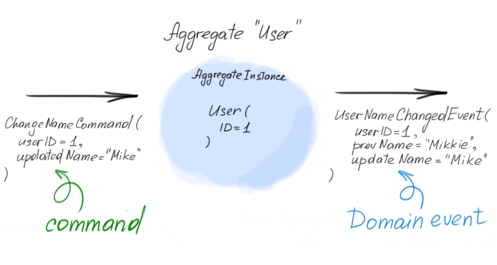
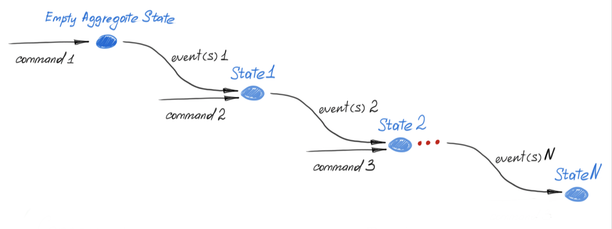
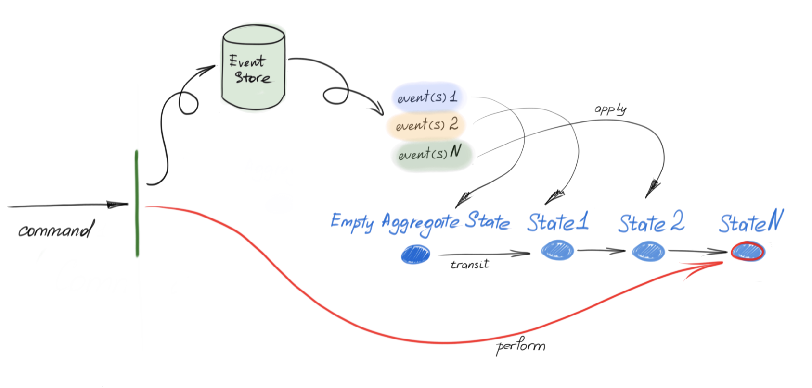
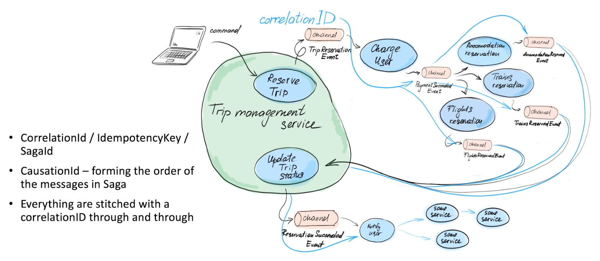
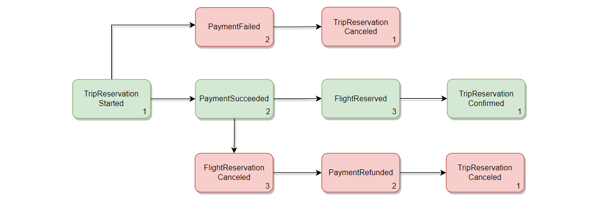
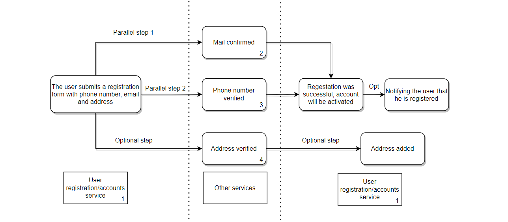
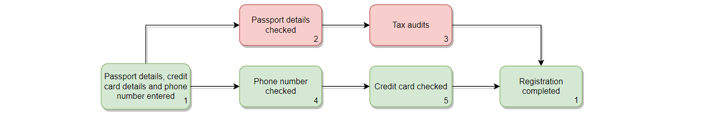

[](https://maven-badges.herokuapp.com/maven-central/ru.quipy/tiny-event-sourcing-spring-boot-starter)


# Tiny event sourcing library

## Getting Started

### Versions
You can find the information about current version and what changes were made on our [releases page](https://github.com/andrsuh/tiny-event-sourcing/wiki/RELEASES-tiny-event-sourcing)

### Installation with Spring Boot Starters
To use library with Spring Boot put the following dependency in your `pom.xml`:

```
<dependency>
    <groupId>ru.quipy</groupId>
    <artifactId>tiny-event-sourcing-spring-boot-starter</artifactId>
    <version>${library.version}</version>
</dependency>
```

Currently, only the mongodb-based event-store implementation is available "out of box".

To use this event-store implementation, put the following dependency to your `pom.xml`:
```
<dependency>
    <groupId>ru.quipy</groupId>
    <artifactId>tiny-mongo-event-store-spring-boot-starter</artifactId>
    <version>${library.version}</version>
</dependency>
```

### Manual installation
If you don't want to use Spring Boot Starters, you need to add these dependencies:
```
<dependency>
    <groupId>ru.quipy</groupId>
    <artifactId>tiny-event-sourcing-lib</artifactId>
    <version>${library.version}</version>
</dependency>
<dependency>
    <groupId>ru.quipy</groupId>
    <artifactId>tiny-mongo-event-store/artifactId>
    <version>${library.version}</version>
</dependency>
```

# DDD, Event sourcing and library essentials

All the terms and technics described in this documentation are part of the Domain Driven design (DDD). You **don’t have to have** some specific knowledge or skills in DDD to use this library. But if you would like to get familiar with it, we can recommend [Implementing Domain-Driven Design](https://www.amazon.com/Implementing-Domain-Driven-Design-Vaughn-Vernon/dp/0321834577) book by Vaughn Vernon.

## The short definition of **Event Sourcing** and **Domain events**

Event sourcing implies the storing an entity as a set of its changes. In order to get the entity you have to obtain all the changes and “apply” them all in order they were made. This approach can give you many benefits:

- You can have full log of changes with an authorID/timestamps and any other metadata you want
- You can get the state of any entity at any point of time
- Other services can listen to the changes and maintain its own local projection of the data they need
- Any of such listeners may be embedded in your system at any point of time and just “read” all the changes from scratch to initialize their local storages. Or they can just replay all the changes in order to migrate their schema for example

These “changes” may have arbitrary structure - you can put there anything you wish to have a comprehensive description of what / where / why / when / by whom was changed.

Since a change describes the *fact* of changing and its details, describes what happened with the entity (Past tense) it’s called **Event** and since it’s something important that happened with some entity within your *domain* it’s called **Domain Event**

**Domain Event** is a central concept of Event sourcing approach. Because each entity is persisted as a set of **Domain Events** and each update/write operation to your system results in a **Domain Event.**

In order to designate that the class is an event of your domain you should mark it with `@DomainEvent` annotation and extend `Event` base class. See the [example](#define-domain-events).

## **Entities** and **Aggregates**

We’ve discussed that in the event-sourcing based systems any change is represented by domain event. Other important concepts - **Aggregates** and **Entities.** These are something that describes our data model and that might be changed. They are the *objects* of changes.

**Entity** in DDD represents some meaningful concept of you business/domain. Each single instance of the entity has an identity. For example within “online-shopping” domain the items in a shopping cart might be an entities with their own id, properties and even links to some other entities like catalog items. In our library we don’t have some special syntax for entities - they are just regular classes.

**Aggregate** represents the *cluster* or *tree* of **Entities** united under some **root entity.** As well as an entity, aggregate has its own ID and can point to some other aggregate by their ID. Developing the previous example in “online-shopping” domain we could represent a shopping cart as an aggregate which contains the list of entities - “cart items”.

Why do we need this? We group logically connected entities into aggregates according to business rules and needs. Aggregate will act as a single unit of update operation in our system. No single entity can be changed apart from the aggregate it’s held by. If you want to change “cart item” you have to submit request to change “shopping cart” and the certain item inside it.

This property enables an aggregate to be a “transactional boundary” - something that is always be changed atomically. That also means that you can define the global invariants that should be maintained within aggregate and all of its nested entities and be sure that they are still enforced after each single update operation.

Let me give a bit farfetched example. You may have a counter in your “shopping cart” which shows how total cost of the “items” in the cart. Each time you add the item you have to increase this total cost. If we had relational DB schema we would have to perform two SQL queries - update items table and then update shopping carts table to increase the total cost. In concurrent environment you have to perform these two queries in a DB transaction to ensure atomicity, consistency, isolation (read [ACID](https://youtu.be/cY9NaL8KT14)). The aggregates bring some kind of denormalisation, but only to the extent that is required and useful for your business, functional and non-functional requirements. As the operation under an aggregate always atomic you can just add item and increase the counter in one method and be sure that after update all the invariants will be enforced.

Aggregate might be a tree of entities, but doesn’t have to be. It might be represented by just a single top level entity. It’s absolutely fine and depends on your application use cases and non-functional requirements. It’s a separate art of designing your aggregates and what “size” they should be. You can find articles about how to choose right size of the aggregates, there are some approaches.

Aggregate cannot be nested in some other aggregate because by definition it would become a single aggregate in this case. But you can easily connect aggregates with each other by referencing them by ID.

In order to designate that the class is an aggregate of your domain you should mark it with `@AggregateType` annotation and extend `Aggregate` base class. See the [example](#define-aggregates).

## **Commands**

We already know that the **Domain Event** is a result of update and the **Aggregate** is an object of an update.

Commands serve as a trigger for update. We (as a system or system’s user) can command to the aggregate to do something. It will then result into domain event publishing if changes succeeded.

In event sourcing the command itself doesn’t make any changes (I mean in DB, because it’s events responsibility), but logic behind command should check the **possibility** of the change, check aggregates **invariants** after the change is applied etc. If change is legal then we can construct the corresponding event and try to save it to DB. Once the event is persisted we can say that command succeeded

In our library the command of `Aggregate` N can be any function that takes instance of N as a receiver (takes an **aggregate state**) and returns subclass of the `Event<N>`. `N.(?) → Event<N>`. Command can take arbitrary number of parameters needed for update. Command logic might and should throw exceptions in case update fails by any reason. So you can check all business rules, perform validations, check aggregate inner invariants here. See the [example](#define-commands).



## **Aggregate state**

Aggregate state represents the state of an aggregate instance after applying some number of changes (events).

Aggregate instance may have a version. It shows the number of events that was applied to the state starting with empty state.

Every new event (change / update) will introduce some changing in an aggregate state. So far as we persist events, not the bare aggregate we will be able to get the state of the aggregate at any point of time by getting all the events up to some version and iteratively "applying" all these events to the aggregate state starting from empty state.




What do we mean by “applying” changes? Interface `AggregateStateTransitionFunction` represents a simple function that takes aggregate state, some aggregate's event and applies the changes described by the event to the state producing the next (updated) state.
You have to implement the logic of applying for each event of an aggregate. Such a function might be implemented both as the member of the aggregate state and as an extension function of the aggregate state and should be marked with `StateTransitionFunc` annotation.

The library code during update:

- Retrieves all the aggregate’s instance events from DB
- Build the current aggregate state by:
  - Creating the empty aggregate state (your state class **must have an empty constructor** for this purpose)
  - Iteratively applying all the event in the insertion order to it. (snapshots optimization is also available)
- Tries to apply new event to the current state to check if it is applicable indeed



And here you can see the example of updating "UserAggregate" instance. Here we change the name of the user with ID=1.


See the example of how to define [aggregate state](#define-aggregate-state) and state [transition functions](#define-aggregate-state-transition-functions)

## **Parallel aggregate updates**

If some parallel process managed to update aggregate earlier than process ran by you (read: they were running simultaneously, but not yours won) you have to repeat your attempt. Just because the state of the aggregate changed and now some validations may fail or some invariants may be broken. Library takes care of such cases. You may not to think about the concurrency troubles - your responsibility is just define aggregates, events and business logic - commands with validations and other checks and events with how they should be applied to an aggregate state. We use an **"optimistic locking"** technique. So if several parallel processes tried to update the same aggregate version only one of the updaters succeeds and others will be made to retry their attempts. So practically all the updates under the same aggregate are serializable.


## Library configuration

First thing you have to do is to define your aggregates, their states, events, commands and state transition functions. See example [here](#example-of-how-to-use-library)

### Manual library configuration

If you use pure library without any frameworks, you have to instantiate or implement the following classes/interfaces:
- Interface `EventMapper` that allows to map some row representation (json String by default) of event to instance of `Event` class and vice versa. There is default implementation for event represented in json format `JsonEventMapper` .
- Class `EventSourcingProperties` contains properties for event sourcing library. You can instantiate the class the default values or read some configuration file and initialize config with this values
- Interface `AggregateRegistry` acts as a local storage of the aggregates and their events meta-information. Provides methods to store (register) this meta-information. Library provides two implementation of the interface: `SeekingForSuitableClassesAggregateRegistry` and `BasicAggregateRegistry` . First automatically scans the classpath (you can define the package for scan in properties) and find all the classes that are marked with `AggregateType` and extend `Aggregate` as well as those marked with `DomainEvent` and extend `Event`  and register them. `BasicAggregateRegistry` requires all the aggregates and event to be manually registered. (**todo example**)
- Interface `EventStoreDbOperations` abstracts away the DB access. Provides the operations for event sourcing functioning. You can provide your own implementation of EventStoreDbOperations and run event sourcing app working on any DB you wish under the hood. There is implementation of `EventStoreDbOperations` which uses MongoDB and can be used only for Spring apps.
- Class `EventSourcingService` for each of the aggregates in your domain. Allows you to update aggregates and get the last state of the aggregate instances. It's convenient to use `EventSourcingServiceFactory` for instantiation of the `EventSourcingService` instances. See [here](#performing-updates-operation-under-the-aggregates).

Here is the class diagram


# Example of how to use library

First, when we implement events sourcing based system we have to define aggregates and their states. In this example we will be having project aggregate.
It represents a project of our task-management system. For the sake of example project aggregate encapsulates all the task in the project and the tags that might be assigned to tasks.
Each task and tag is a separate entity with their own ID. You can see that the structure is denormolized.

This example is farfetched a bit. Tags and task methods might have been (and probably should be) separate aggregates. But it's supposed to demonstrate you the benefits of atomic updates.
For example, you can atomically add new tag to project and increment some counter that shows how many tags we have in project.

## Define Aggregates

In our library the aggregate itself is a part of the public API. Therefore, it doesn't contain any business logic. Just serves as a marker for other services that there is such an aggregate with some number of events. Services may import this public API and subscribe to the aggregate's events.
Lets define Project Aggregate:
```kotlin
@AggregateType(aggregateEventsTableName = "aggregate-project")
class ProjectAggregate : Aggregate
```
`@AggregateType` annotation contains some meta-information about aggregate recognisable by library. For example here we define the name of the database table which stores events for aggregate of type `ProjectAggregate`.
User written Aggregate class has to implement Aggregate interface-marker from the library.

## Define Aggregate state

Now we need some class that describes the inner state of the aggregate instance at different points of time. It's used only for your service and can be defined this way:
```kotlin
class ProjectAggregateState: AggregateState<String, ProjectAggregate> {
  private lateinit var projectId: String
  private var createdAt: Long = System.currentTimeMillis()
  private var updatedAt: Long = System.currentTimeMillis()

  private var tasks = mutableMapOf<UUID, TaskEntity>()
  private var projectTags = mutableMapOf<UUID, ProjectTag>()

  override fun getId() = projectId
}

// nested aggregate entity
data class TaskEntity(
    val id: UUID = UUID.randomUUID(),
    val name: String,
    val tagsAssigned: MutableSet<UUID>
)

// nested aggregate entity
data class ProjectTag(
    val id: UUID = UUID.randomUUID(),
    val name: String
)
```
As you can see here we define the aggregate state with all of its internals - nested entities and any other fields you wish. It just should reflect the state of the aggregate.
Note that we have to implement method `fun getId()` defined by `ProjectAggregateState` and pay attention to its contract. It returns the aggregate ID or null if the state is just created (empty, initial state). The ID should be assigned by the first aggregate command-event pair.
Note, that State should have a constructor with a single parameter - id

## Define Domain events

Each aggregate has a set of domain events. Events along with Aggregates are the public API of a service. Other services may import them to subscribe and listen to your services changes. Event classes does not contain any business logic. Just set of properties that describes what was changed.

Example below demonstrates how we define event of creating new **tag** within the project:
```kotlin
@DomainEvent(name = TAG_CREATED_EVENT)
class TagCreatedEvent(
    val projectId: String,
    val tagId: UUID,
    val tagName: String,
    createdAt: Long = System.currentTimeMillis(),
) : Event<ProjectAggregate>(
    name = TAG_CREATED_EVENT,
    createdAt = createdAt,
)
```

`@DomainEvent` annotation is also from the library. It accepts name of the event. Name will be persisted to DB and used to know which class the row content of the event should be deserialized to.
This is how this event with its meta-information looks in database:


## Define commands
Commands in our library are represented by methods that take current aggregate state, perform all checks and validations and produces event if changes is allowed and legit. For example, it may be a member function of the aggregate or extension function.
```kotlin
fun UserAggregate.createUserCommand(
   userId: UUID = UUID.randomUUID(),
   name: String,
   password: String,
   login: String
): UserCreatedEvent {
   if (name.length < 3) {
      throw IllegalArgumentException("Name is too small aggregate id: $aggregateId")
   }
   if (password.isBlank()) {
      throw IllegalArgumentException("Can't change password: empty provided. Aggregate id: $aggregateId")
   }
   if (password.length < 8) {
      throw IllegalArgumentException("Password is too weak aggregate id: $aggregateId")
   }
   
   return UserCreatedEvent(
      userId = userId,
      userLogin = login,
      userPassword = password,
      userName = name
   )
}
```
Command could use State fields to perform validation, but **should not modify aggregate state**. Command should not have any side effects besides event emitting
## Define aggregate State transition functions

There is one thing left to do before we are able to make changes on our aggregates. We have to teach the library to construct a current state of an aggregate.
Each event describes changes that move aggregate state N to the next state N + 1. It's done by `AggregateStateTransitionFunction`. A state transition function takes aggregate state, some aggregate's event and applies the changes described by the event to the state producing the next (updated) state.
If we take all the events (N events) from aggregate event log and iteratively call corresponding transition functions starting with an empty aggregate state, it will go over N state transitions and will end up in the most actual state.
You can define them as member or extension functions of the aggregate state and mark with `StateTransitionFunc` annotation. Let's look at the example:
```kotlin
class ProjectAggregateState: AggregateState<String, ProjectAggregate> {
     private lateinit var projectId: String
     private var createdAt: Long = System.currentTimeMillis()
     private var updatedAt: Long = System.currentTimeMillis()

     private var tasks = mutableMapOf<UUID, TaskEntity>()
     private var projectTags = mutableMapOf<UUID, ProjectTag>()

     override fun getId() = projectId
  
    @StateTransitionFunc
    fun tagCreatedApply(event: TagCreatedEvent) {
        projectTags[event.tagId] = ProjectTag(event.tagId, event.tagName)
        updatedAt = createdAt
    }

    @StateTransitionFunc
    fun taskCreatedApply(event: TaskCreatedEvent) {
        tasks[event.taskId] = TaskEntity(event.taskId, event.taskName, mutableSetOf())
        updatedAt = createdAt
    }
}

@StateTransitionFunc
fun ProjectAggregateState.tagAssignedApply(event: TagAssignedToTaskEvent) {
    tasks[event.taskId]?.tagsAssigned?.add(event.tagId)
        ?: throw IllegalArgumentException("No such task: ${event.taskId}") // todo sukhoa exception or not?
    updatedAt = createdAt
}
```

## Performing updates operation under the aggregates

You have to use `EventSourcingService` class instance to perform updates on an aggregate. The easiest way to create it id to use `EventSourcingServiceFactory` instance. It's parametrized with ID type of the aggregate, aggregate class type and it's state type.
```kotlin
 eventSourcingServiceFactory.create<String, ProjectAggregate, ProjectAggregateState>()
```

Once you have the instance of `EventSourcingService<UserAggregate>` you can inject it whenever you wish and use `create` method to create the aggregate instance.
```kotlin
projectEventSourcingService.create { project ->
    project.createNew(projectId = UUID.randomUUID(), title = "My first project")
}
```

Then you can use method `update` to do some changes on aggregate. The method takes two parameters - `aggregateId` and `eventGenerationFunction`. First one doesn't require any explanations. The second parameter is a function that takes the aggregate state and returns event if change is legit. In other words - it is a command. Look at how can you use it:
```kotlin
projectEventSourcingService.update(projectId) { project ->
    project.addTask("New task for you!")
}
```


## Define Subscribers
Second important concept of this example are subscribers. You can make subscriptions in two ways.

### Annotation-based subscribers
First one is this:
```kotlin
@Service
@AggregateSubscriber(aggregateClass = UserAggregate::class, subscriberName = "demo-user-stream")
class AnnotationBasedUserEventsSubscriber {
    private val logger: Logger = LoggerFactory.getLogger(AnnotationBasedUserEventsSubscriber::class.java)

    @SubscribeEvent
    fun userCreatedSubscriber(event: UserCreatedEvent) {
        logger.info("User created {}", event.userName)
    }
}
```
As can be seen from the name of the class, it's annotation based.
It uses @AggregateSubscriber annotation, and listens to specific aggregate type catching it events.
library's subscription manager searches for this annotation. After it has found it, it looks for Subscribe event annotated method and analyzes the Event it returns.
In the example we catch UserCreatedEvent and write it down in the logger.
The second way of doing subscriptions will be shown in the next chapter that is about Projections.

If you've chosen to use annotation-based subscribers you have to explicitly pass the subscriber's instance to the `AggregateSubscriptionsManager` this way:
```kotlin
  subscriptionsManager.subscribe<UserAggregate>(userEventsSubscriber)
```
If you use `Spring framework` you can do this in `@PostContruct` method of the subscriber bean.

### Projections and handler-based subscribers

Another important aspect of example is projections/views usage.
Aggregates are mostly used for writing and changing information.
In order to present information we use concept of projections/views.
Briefly speaking, projections/views are slices of some aggregates tailored for some usage.
In the example we're using projections for payments.
Hence, we take from aggregate only the information we need for payments
```kotlin
class UserPaymentsViewDomain {
    @Document("user-payment-view")
    data class UserPayments(
        @Id
        override val id: String, // userId
        var defaultPaymentMethodId: UUID? = null, //Id of favorite payment
        val paymentMethods: MutableMap<UUID, Payment> = mutableMapOf() // map to hold all payments
    ) : Unique<String>

    data class Payment(
        val paymentId: UUID,
        val payment: String
    )
}
```
This is the projection created for payment service.
It has only the fields that are needed by payments system.
```kotlin
class UserPaymentsViewService(
    private val userPaymentsRepository: UserPaymentsRepository,
    private val subscriptionsManager: AggregateSubscriptionsManager
) {
    private val logger: Logger = LoggerFactory.getLogger(UserPaymentsViewService::class.java)

    @PostConstruct
    fun init() {
        subscriptionsManager.createSubscriber(UserAggregate::class, "userPayments-payment-event-publisher-stream") {
            `when`(UserCreatedEvent::class) { event ->
                createUserPayment(event.userId, event.userName)
                logger.info("User Payment Created {}", event.userName)
            }
            `when`(UserAddedPaymentEvent::class) { event ->
                addPayment(event.paymentMethodId, event.userId, event.paymentMethod)
                logger.info("User Payment added {}", event.paymentMethod)
            }
            `when`(UserSetDefaultPaymentEvent::class) { event ->
                setDefaultPayment(event.userId, event.paymentMethodId)
                logger.info("Default User Payment selected {}", event.paymentMethodId)
            }
        }
    }
    private fun createUserPayment(userId: String, userName: String) {
        val userPayments = UserPaymentsViewDomain.UserPayments(userId)
        userPaymentsRepository.save(userPayments)
    }
}
```
This is service that works with this projection. Whenever a UserCreatedEvent is emitted by  UserAggregate it catches it,
and creates a user payment entity of this user. Also, here you can see a second way to create subscriptions using subscription manager and `when`

# Example description
This example works such way:
We have one UserAggregate. It's responsible for the user entity.
UserCommandsController uses eventssourcingservice to execute commands on the user aggregate.
The user Aggregate can be created. We can add both payments methods and delivery addresses and also change default address and payment.
Also, you can change the password of the user there. Then we have UserPaymentsViewDomain that is responsible for creating payment projection.
It catches the events emitted by UserAggregate, and creates projection based on them.

# **Example of using the Saga pattern implementation <sup>[<small>in Russian</small>](https://github.com/MaxZhukoff/saga-examples/tree/master/.doc)</sub>**

## **Introduction to the Sagas**

One drawback of the microservice architecture concerns the execution of transactions that involve multiple services. In a monolithic architecture, the DBMS (Database Management System) fully provides the functionality of *ACID transactions*. However, in a microservices architecture which uses the *"Database per service"* pattern, a more elaborate transaction processing mechanism is required.

And the Saga pattern, as a way to organize transactions in a distributed system, is a good solution in such a situation. The definition of Saga is as follows – *a sequence of local transactions coordinated by asynchronous messages*. I.e. each service, after completing its part of the distributed transaction and recording it in its local database, publishes an event, on the basis of which the following Saga participants.

In *ACID transactions*, in case of failure, the *rollback* command is executed automatically to ensure atomicity. However, when using the Saga pattern, you need to write corresponding compensating transactions that should undo the changes already made. This will be illustrated with examples.

The Saga pattern can be implemented in two ways: *orchestration* and *choreography*. In the library's implementation, a choreographic approach is used, where there is no central coordinator issuing commands to participants. Instead, participants subscribe to each other's events and react accordingly. Choreographic Sagas can also be called dynamic because there is no centralized place to see which services are participants in a particular distributed transaction, and because the Saga itself can constantly change.

## **Implementation of Saga in the library**

You can now take a look at how this is implemented in the library.  
Interaction with Sagas is done using `SagaManager`. By default, all the tools for interacting with Sagas are enabled, but if you want to create your own implementation, you can disable the built-in Saga pattern implementation in the configuration by setting: `event.sourcing.sagas-enabled=false`.

To start a Saga, you need to create the first step of the Saga. You can do this by calling the `launchSaga(sagaName, stepName)` method on the `SagaManager`, providing `sagaName` as the name of the process and `stepName` as the name of the current step. After executing this method, you will obtain a `SagaContext`, which represents the result of the Saga step, and you can pass this context when updating the aggregate.
```kotlin
//Initialization of SagaContext by SagaManager
val sagaContext = sagaManager
    //Initialize first step, sagaName="SAGA_EXAMPLE", stepName="First step"
    .launchSaga("SAGA_EXAMPLE", "First step")
    .sagaContext //Get initialized sagaContext

//Pass SagaContext to the method for creating/updating an aggregate
//As a result, it will be stored in the event
val event = someEsService.create(sagaContext) {
    it.someMethod(params...)
}
//or
val event = someEsService.update(aggregateId, sagaContext) {
    it.someMethod(params...)
}
```
Inside the `SagaManager`, a `SagaContext` is created - a class that contains a `ctx` map where the key is `sagaName` and the value is metadata about the previous step. This metadata includes:
- `stepName`,  which, like `sagaName`, is set by the user
- `sagaStepId` – the identifier of the Saga step.
- `sagaInstanceId` – the identifier of the Saga itself, which will be common to a particular distributed transaction
- `prevStepsIds` – identifiers of previous Saga steps

`SagaContext` is passed along with the event that the next service in the Saga execution chain subscribes to. In that service, you can extract the previous context and continue Saga execution.  
All of this is done through `SagaManager` by calling `withContextGiven(SagaContext)` method, followed by `performSagaStep`, which takes the same parameters as `launchSaga`:
```kotlin
val sagaContext = sagaManager
    .withContextGiven(event.sagaContext) //Extract metadata from the previous event
    .performSagaStep("SAGA_EXAMPLE", "Second step")
    .sagaContext
```
To track the sequence of events in a Saga, the `SagaContext` contains `prevStepsIds/correlationId` - identifiers of the previous or one previous Saga step.  
The following picture roughly demonstrates how this metadata is passed from one service to another.  


You can view the code that is made from this image _[here](https://github.com/MaxZhukoff/saga-examples/tree/master/simple-saga-demo)_. _But it's a bit simplified there._  
Here's how the execution scenarios of the Saga based on events look in this example:



The successful scenario is denoted in green, and the unsuccessful one is in red. If one of the Saga transactions fails, it is necessary to initiate the logic of **compensating** transactions to maintain consistency in the system.

In the library, compensating transactions are defined in the same way as regular ones. That is, in case of an error, you need to create an event that the services, which were previous in the transaction chain, will act upon.

For example, let's consider what will happen after an error occurs in the `"flights"` service.  
First, the _`FlightReservationCanceledEvent`_ event is created. After that, the subscriber of the `"payment"` service - [_`PaymentFlightSubscriber`_](https://github.com/MaxZhukoff/saga-examples/blob/master/simple-saga-demo/src/main/kotlin/ru/quipy/saga/simple/payment/subscribers/PaymentFlightSubscriber.kt) - will roll back the changes made earlier in this service. Then, the process will return to the service that started this Saga, which will record the fact that the entire process has failed.  
I.e. you, as a user, build the necessary business process yourself, including the logic of _compensating transactions_.

### **_Parallel processes_**

If your business logic requires Saga to execute not only sequentially, but also in **parallel**, meaning that you need to wait for the completion of several previous steps to continue with a particular step, you can pass multiple `sagaContexts` to the `witchContextGiven()` method by combining them using the **"+"** operator. You can see an example of Saga with parallel steps by following this _[link](https://github.com/MaxZhukoff/saga-examples/tree/master/aggregation-saga-demo)_.  
Here's what the execution scenario of this Saga looks like:  


In the example, it is necessary to wait for two events - `Service2ProcessedEvent` and `Service3ProcessedEvent` in the account service (`service1`). One way to achieve this is to create a projection/view to store events. [Here](https://github.com/MaxZhukoff/saga-examples/blob/master/aggregation-saga-demo/src/main/kotlin/ru/quipy/saga/aggregation/service1/subscribers/Service2Service3Subscriber.kt), a projection named `aggregation-example` is created, where the id corresponds to the Saga's id. It contains certain information from two events that are necessary to continue the Saga. When one of the events arrives, it checks if a projection with the Saga's id exists. If it doesn't exist, a new projection is created and the information about the first event is stored. However, in the case where the projection already exists, the execution of the Saga continues based on the data from this projection.  
Here's how the context is created based on two previous `sagaContexts`
```kotlin
val sagaContext = sagaManager
    .withContextGiven(prevSagaContext_1 + prevSagaContext_2)
    .performSagaStep("SAGA_EXAMPLE", "finish saga")
    .sagaContext
```
For such an event created based on two previous steps, the `prevStepsIds` will accordingly contain two Saga step IDs.

#### **_Nested Sagas_**

The `ctx` map in `SagaContext` was intentionally included to allow the creation of **nested Sagas** using this feature.  
If you need to separate multiple steps within a single saga, i.e. create a **nested saga**, you can do it as shown in this _[example](https://github.com/MaxZhukoff/saga-examples/tree/master/nested-saga-demo)_.  
Here's what the execution scenario of this Saga looks like:  


In this case, the nested Saga is also parallel, but that's not a prerequisite. The idea is to compartmentalize subprocesses within a larger business process.  
In this scenario, the main Saga will include all the steps, but the nested Saga will contain only the two steps highlighted in red.  
The creation of the nested Saga `NESTED_SAGA_EXAMPLE` and the parallel continuation of the main `SAGA_EXAMPLE` takes place in [`Service2`](https://github.com/MaxZhukoff/saga-examples/blob/master/nested-saga-demo/src/main/kotlin/ru/quipy/nested/service2/subscribers/Service1Subscriber.kt). The next step takes place in [`Service3`](https://github.com/MaxZhukoff/saga-examples/blob/master/nested-saga-demo/src/main/kotlin/ru/quipy/nested/service3/subscribers/Service2Subscriber.kt).

### **_Simplified version_**

In the library, there is the possibility to use a **simplified approach** to implement the Saga pattern, without using `SagaManager`. For this purpose, `SagaContext` contains three additional values in addition to `ctx`:
- `correlationId` – means the same as `sagaInstanceId` from `ctx`
- `currentEventId` – means the same as `sagaStepId` from `ctx`
- `causationId` – means the same as `prevStepsIds` from `ctx`, but can only contain one value

If you use this simplified approach, the Saga and its steps will not have names. Also, you won't be able to create nested Sagas or parallel steps.  
To use this approach you just need to pass the `SagaContext` of the previous event when updating the aggregate.  
You can see an example of such a Saga _[here](https://github.com/MaxZhukoff/saga-examples/tree/master/default-saga-demo "This is a remodeled first example")_.

## **Saga projections**

Currently, to track the entire execution process of a Saga, you need to contact each participating service. However, using projections, you can gather information about Sagas in one place. This allows you to monitor the state of Sagas, retrieve all steps for a `sagaInstanceId`, track the time it took to process each step, and determine in which service an error occurred.

To understand how projections are set up, it's helpful to have some knowledge of how certain processes inside the library related to Sagas work.

For local storage of information about Sagas, the `SagaStepAggregate` is used. This aggregate has 4 events:
- `SagaStepLaunchedEvent` – indicates that the first Saga step has been **initiated** but has not yet been processed
- `SagaStepInitiatedEvent` – indicates that a subsequent Saga step has been **initiated** but has not yet been processed
- `SagaStepProcessedEvent` – indicates that the Saga step has been **processed** and stored in the `EventStore`
- `DefaultSagaProcessedEvent` –  indicates that the default Saga step has been processed

All these events are stored in the `sagas` table. Each service/bounded context will have its own table for this purpose.

The library also includes an *event-stream* called `SagaEventStream` for working with Sagas. It's necessary to keep track of whether a Saga event has been successfully processed and stored in the database. This *event-stream* subscribes to events from **all** aggregates and looks for *meta-information* related to Sagas in them. It then sends commands to the `SagaStepAggregate`, which publishes either `SagaStepProcessedEvent` or `DefaultSagaProcessedEvent` events.

So `SagaManager` is used to record the fact that a Saga step has started processing, while `SagaEventStream` is used to determine when the event has been successfully processed.

It's important to note that in the simplified version of using Sagas, the `SagaStepLaunchedEvent` and `SagaStepInitiatedEvent` events are not published because `SagaManager` is not used. Instead of that, only one event is published - `DefaultSagaProcessedEvent`.

In the library, there is already a ready-made service from the `tiny-event-sourcing-sagas-projections` module for tracking Sagas.  
This service subscribes to events from the local Saga aggregates `SagaStepAggregate` and creates tables `sagas-projections` for the extended version and `sagas-default-projections` for the simplified version. This service allows you to keep track of all the Sagas in the system in one place.

In the projection, a separate document is created for each Saga, containing its `sagaInstanceId`, `sagaName`, and all its steps - `sagaSteps`. In `sagaSteps`, in addition to `sagaStepId`, `prevStepsId` and `stepName`, there is information about when the step processing started, when it was successfully completed and the name of the event associated with this step. The entire sequence of steps can be traced using `sagaStepId` and `prevStepsId`. Additionally, a simple sorting by `sagaStepId` and `prevStepsId` is implemented.

To create your own service for tracking Sagas, you first need to determine what will be stored in the projections.  
(*String* is used everywhere for easier representation of this data in the database, but it's not mandatory).
```kotlin
@Document("sagas-projections")
data class Saga(
    @Id
    val sagaInstanceId: String, //UUID
    val sagaName: String?,
    val sagaSteps: MutableList<SagaStep> = mutableListOf()
)

data class SagaStep(
    val stepName: String,
    val sagaStepId: String, //UUID
    val prevStepsId: Set<String> = setOf(), //UUID
    //Step processing start time (in milliseconds)
    val initiatedAt: String, //Long
    //The time when the step was processed and stored in the database (in milliseconds)
    var processedAt: String? = null, //Long
    var eventName: String? = null
)
```
Second, you need to create a subscriber for events from `SagaStepAggregate`. [At the beginning of the chapter there is a list and descriptions of all events](#Saga-projections). You should store the necessary information in the subscriber.

An example for `SagaStepLaunchedEvent`:
```kotlin
subscriptionsManager.createSubscriber(SagaStepAggregate::class, "local-sagas::sagas-projections") {
    `when`(SagaStepLaunchedEvent::class) { event ->
        val sagaName = event.sagaName
        val stepId = event.sagaStepId.toString()
        val stepName = event.stepName

        val saga = Saga(event.sagaInstanceId.toString(), sagaName)

        val newStep = SagaStep(
            stepName,
            stepId,
            event.prevSteps.map { it.toString() }.toSet(),
            event.createdAt.toString()
        )
        insertNextStep(saga.sagaSteps, newStep)

        sagaProjectionsRepository.save(saga)
    }
}
```
In the example above, information about the Saga and its step is extracted from the event and stored in the database.  
For `SagaStepInitiatedEvent` the behavior will be almost the same as for `SagaStepLaunchedEvent`.  
For `SagaStepProcessedEvent`, it is sufficient to update the already saved Saga step:
```kotlin
`when`(SagaStepProcessedEvent::class) { event ->
    //Find the Saga projection that requires updating the step
    val saga = sagaProjectionsRepository.findById(event.sagaInstanceId.toString()).get()

    //Extract the information from the event
    val sagaName = event.sagaName
    val stepId = event.sagaStepId.toString()
    val stepName = event.stepName

    //Update the Saga step
    val sagaStep = saga.sagaSteps.find { it.sagaStepId == stepId }
    sagaStep?.processedAt = event.createdAt.toString()
    sagaStep?.eventName = event.eventName
}
```
